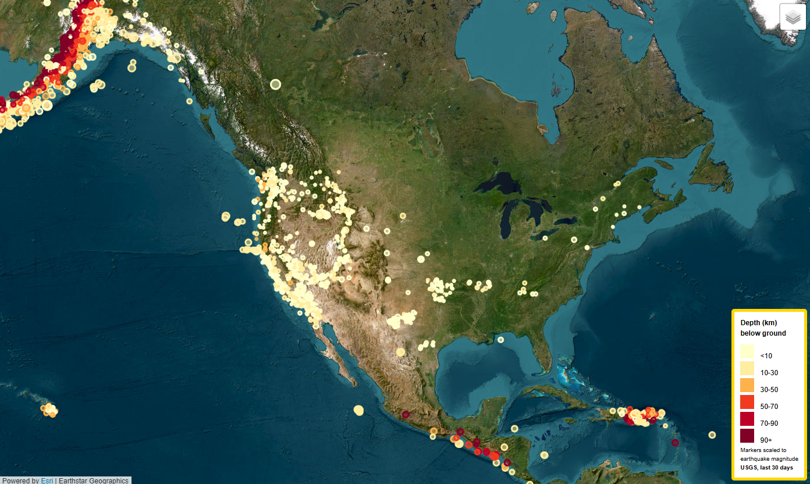
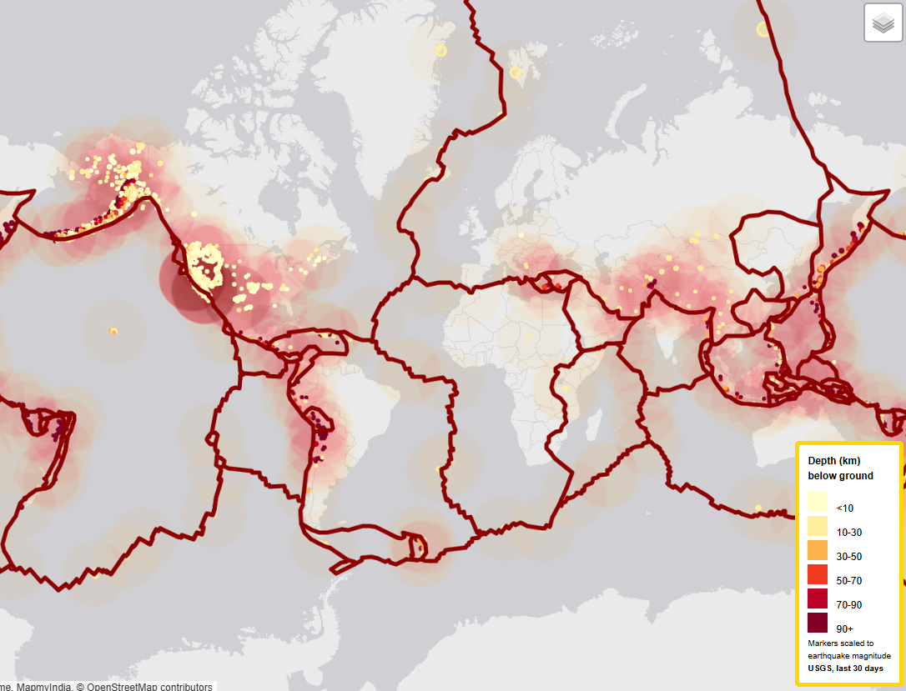

# USGS Earthquake Map with JavaScript and Leaflet

*Explore Earth's seismic activity in real time—with JavaScript, Leaflet, and geospatial data.*

🌍 [Live Map](https://johbry17.github.io/USGS-Earthquake-Map/)

> ⚠️ This project is archived and no longer actively maintained, but remains available as a portfolio example.

## Table of Contents

- [Project Overview](#project-overview)
- [Features](#features)
- [Tools & Technologies](#tools--technologies)
- [Usage](#usage)
- [Gallery](#gallery)
- [References](#references)
- [Acknowledgements](#acknowledgements)
- [Author](#author)

## Project Overview

The **USGS Earthquake Map** is an interactive web visualization of global seismic activity. Using real-time data from the [USGS Earthquake API](https://earthquake.usgs.gov/earthquakes/feed/v1.0/geojson.php), this project plots earthquakes by magnitude, overlays tectonic plate boundaries, and allows users to explore patterns through map layers and visual cues.

Originally built as a hands-on geospatial exercise, this dashboard illustrates the power of public data and open-source tools in helping us better understand our planet’s dynamic crust.

## Features

- 🗺️ **Interactive Map** built with Leaflet.js and D3  
- 🌍 **Real-time USGS earthquake data** with size and color-coded markers  
- 🔥 **Heatmap overlay** for frequency and density  
- 🧭 **Tectonic plate boundaries** toggleable for geologic context  
- 🧩 **Custom basemaps and layers** with full toggle control  
- 📱 **Mobile-responsive layout**

## Tools & Technologies

- **JavaScript** – Core logic and interaction  
- **Leaflet.js** – Map rendering and layer control  
- **D3.js** – GeoJSON handling and data formatting  
- **USGS GeoJSON Feed** – Earthquake data API  
- **Tectonic Plate Data** – Overlay from open GeoJSON sources  
- **HTML/CSS** – Structure and layout  
- **GitHub Pages** – Deployment

## Usage

Visit the live site [here](https://johbry17.github.io/USGS-Earthquake-Map/).  
Use the layer control to:
- Switch between multiple base maps.
- Toggle earthquake markers, tectonic plates, and heatmaps.
- Explore real-time USGS data in geographic context.

## Gallery

Earthquake Markers:

Tectonic Plate Overlay:

Heat Map View:

## References

-  [USGS Earthquake API](http://earthquake.usgs.gov/earthquakes/feed/v1.0/geojson.php)
- Tectonic plate boundaries from [github.com/fraxen/tectonicplates](https://github.com/fraxen/tectonicplates)

## Acknowledgements

Thanks to Geronimo Perez for feedback and assistance during development.

## Author

Bryan Johns, September 2023  
[bryan.johns.official@gmail.com](mailto:bryan.johns.official@gmail.com) | [LinkedIn](https://www.linkedin.com/in/b-johns/) | [GitHub](https://github.com/johbry17) | [Portfolio](https://johbry17.github.io/portfolio/index.html)
